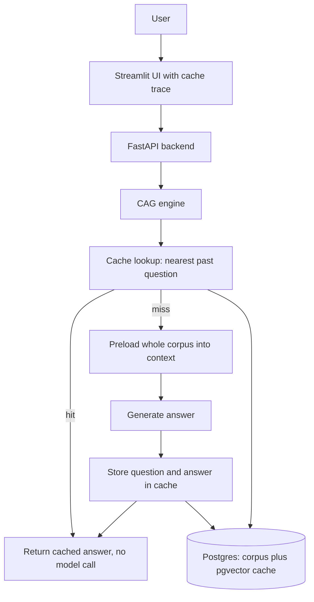

# RagFlowCache

**Cache augmented RAG. The whole corpus is preloaded into context, no retrieval, and repeated questions are served instantly from a semantic cache. Part of the RagFlow line.**

**Part of the RagFlow line, a series of reference enterprise RAG implementations. This repository is RagFlowCache, Cache Augmented Generation.** See [the full line](#the-ragflow-line) below.

RagFlowCache answers in one of two ways. If a past question is close enough to the new one, it returns the stored answer straight from a semantic cache, with no model call at all. Otherwise it preloads the whole small corpus into the prompt and answers from documents already in context, then remembers the result so the next repeat is instant. There is no retrieval step, no chunking for search, and no reranker. It runs fully locally on Ollama at no cost.

[](https://github.com/mlvpatel/RagFlowCache/actions/workflows/ci.yml)    


The clip above is a live, unedited run on a local model. The first answer comes from the preloaded corpus; the trace then shows a repeated question served from the cache with no model call. A full resolution screenshot is at [assets/screenshots/ragflowcache-ui.png](assets/screenshots/ragflowcache-ui.png). No paid keys were used.

## What makes it cache augmented

Retrieval augmented generation searches for the right fragments on every question. Cache augmented generation makes a different bet: for a small, stable knowledge base, skip the search entirely.

| Idea | How it works here |
|---|---|
| Preloaded context | The full text of every document is stored and, on a miss, placed directly in the prompt (capped so it fits the context window). The model reads the whole corpus, not retrieved snippets. |
| No retrieval | There is no vector search over chunks, no hybrid fusion, and no reranker. Fewer moving parts, and nothing to tune or mis-rank. |
| Semantic cache | Every answered question is embedded and stored. A new question that is close enough, by cosine similarity, returns the cached answer with no model call, which is the fast path. |

The trade is deliberate: this suits small corpora that change slowly, where the whole knowledge base fits in context and questions repeat. It is the companion to retrieval, not a replacement for it.

## How a question is answered

The question is embedded and compared to past questions in the cache. On a hit, the stored answer is returned immediately. On a miss, the whole corpus is preloaded into the prompt, the model answers from it, and the answer is written back to the cache. On a question the documents do not cover, the model answers honestly that it does not have the information rather than inventing one.

## Features

| Area | Capability |
|---|---|
| Cache augmented | Whole corpus preloaded into context, no retrieval step |
| Semantic cache | Repeated or near duplicate questions served from a pgvector cache, no model call |
| Grounded first | Answers strictly from the preloaded documents |
| Models | OpenAI, Anthropic, or local Ollama, chosen by model name |
| Wide context | The Ollama context window is widened so the corpus fits |
| Observability | The trace shows a cache hit or miss, the similarity, and the corpus size used |
| Memory | Multi turn sessions stored in Postgres |
| Security | API key auth, rate limiting, input sanitization, CORS |
| Packaging | Docker Compose, Prometheus metrics, tests, CI |

## Architecture



## How to use

### Local, fully offline with Ollama (no paid keys)

```bash
# 1. Data services
make db-up             # postgres with pgvector, plus redis

# 2. Ollama and the local models
ollama serve &
ollama pull nomic-embed-text
ollama pull qwen2.5:7b-instruct

# 3. Install and run
make install
EMBEDDING_PROVIDER=ollama make dev        # API on :8000
make frontend                             # UI on :8501, second terminal
```

Ask a question, then ask it again, and open the trace to watch the second answer come straight from the cache.

## Try it with the bundled sample data

The repo ships sample documents in [sample_data](sample_data), an HR handbook, a product FAQ, and a real SEC 10-K excerpt. With the stack up:

```bash
make load-samples
```

This loads the full text of each document into the corpus. Then ask the questions in [sample_data/README.md](sample_data/README.md), including an honesty check where the system should decline rather than guess.

## Configuration

| Setting | Default | Meaning |
|---|---|---|
| EMBEDDING_PROVIDER | google | google or ollama |
| CAG_SIMILARITY_THRESHOLD | 0.85 | cosine similarity at or above which a question hits the cache |
| CAG_MAX_CONTEXT_CHARS | 12000 | cap on how much of the corpus is preloaded into the prompt |
| OLLAMA_NUM_CTX | 8192 | context window for local models, widened to fit the corpus |
| API_KEY | change_me | required in the X-API-Key header |

## API reference

| Method and path | Purpose |
|---|---|
| GET /health | Liveness, no auth |
| POST /v1/chat | Cache augmented answer, with whether it was cached |
| POST /v1/upload-doc | Upload a document and add its full text to the corpus |
| GET /v1/list-docs | List documents in the corpus |
| POST /v1/delete-doc | Remove a document from the corpus |
| GET /metrics | Prometheus metrics |

## Testing

```bash
make test        # unit tests, no database or model needed
```

Unit tests cover the API contract, the config, and the corpus loading task, with the model and database mocked. The integration test proves an end to end cache hit against a live Ollama.

## Project structure

```
src/cag/          cache augmented core: corpus and cache store, engine
src/api/          FastAPI app, endpoints, security, Postgres memory
src/core/         config, LLM helpers, logging
src/embeddings/   the question embedder and a plain text loader
frontend/         Streamlit UI with the cache trace
sample_data/      runnable sample documents
tests/            unit and integration tests
docker/           Dockerfile and Compose stack
```

## The RagFlow line

RagFlowCache is one implementation in the RagFlow line, a series demonstrating distinct enterprise RAG retrieval strategies. Related approaches are the agentic RagFlowProPlus, the knowledge graph RagFlowKAG, and this cache augmented companion.

| Year | Repository | Generation |
|---|---|---|
| 2022 | [RagFlow](https://github.com/mlvpatel/RagFlow) | Naive RAG, single dense retrieval |
| 2023 | [RagFlowPlus](https://github.com/mlvpatel/RagFlowPlus) | Advanced RAG, hybrid retrieval and reranking |
| 2024 | [RagFlowPro](https://github.com/mlvpatel/RagFlowPro) | Modular production RAG, pgvector, streaming, evaluation |
| 2025 | [RagFlowProPlus](https://github.com/mlvpatel/RagFlowProPlus), [RagFlowKAG](https://github.com/mlvpatel/RagFlowKAG), RagFlowCache (this repo) | Agentic, knowledge augmented, and cache augmented |
| 2026 | [RagFlowProMax](https://github.com/mlvpatel/RagFlowProMax), UltimateRAG | Multi agent enterprise, multimodal |

The full line is collected in the [rag-catalog](https://github.com/mlvpatel/rag-catalog) hub, which benchmarks the main implementations on the same golden questions, keyless.

## Author

Malav Patel. GitHub @mlvpatel.

## License

Released under the MIT License. See [LICENSE](LICENSE). MIT is the simplest and most permissive of the common licenses, so anyone can read, run, modify, and reuse the code freely.
