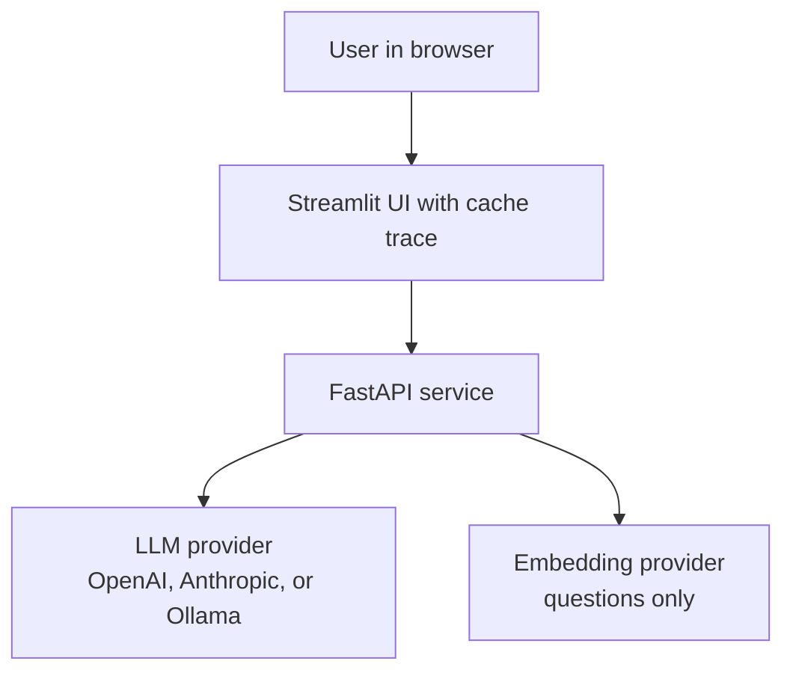
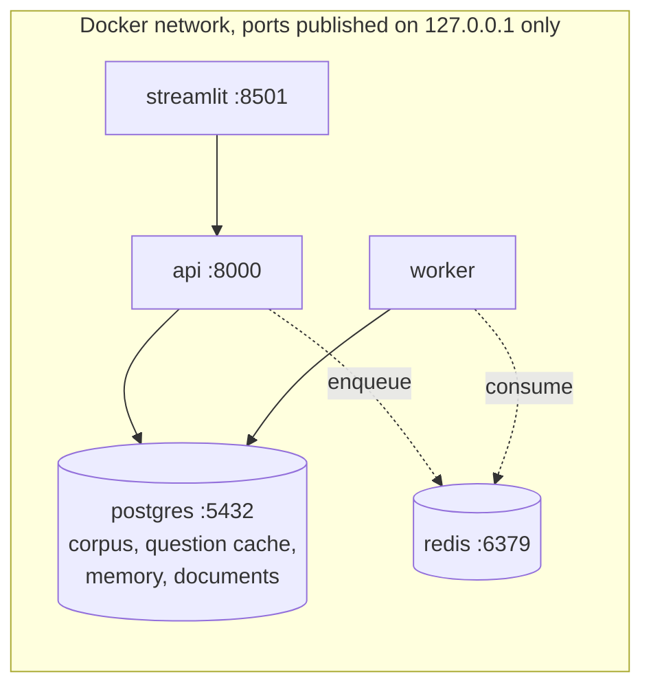
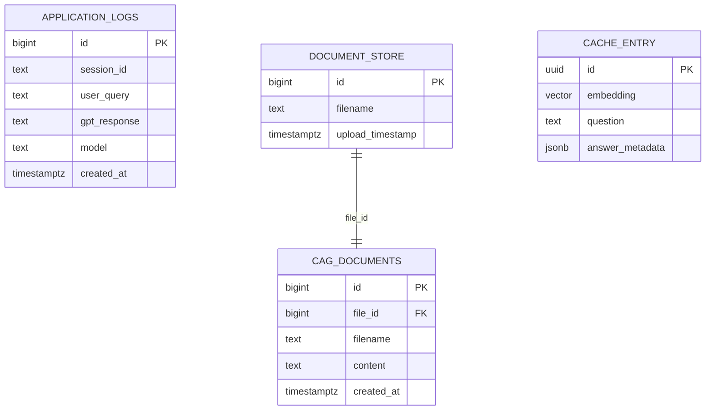
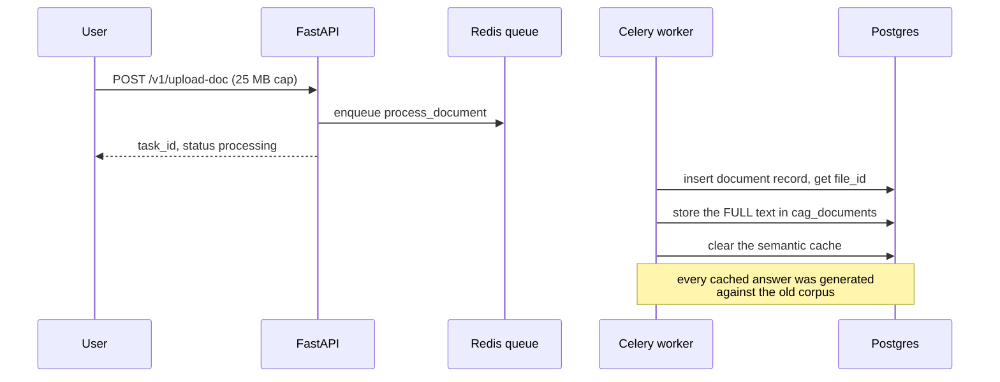
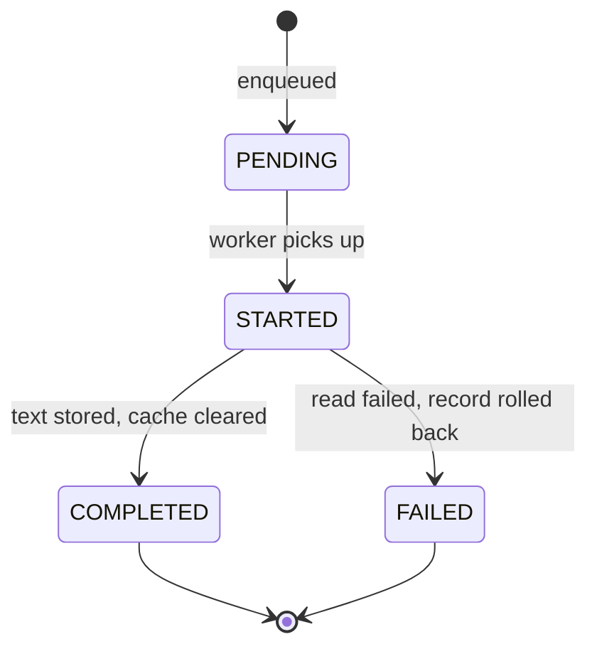
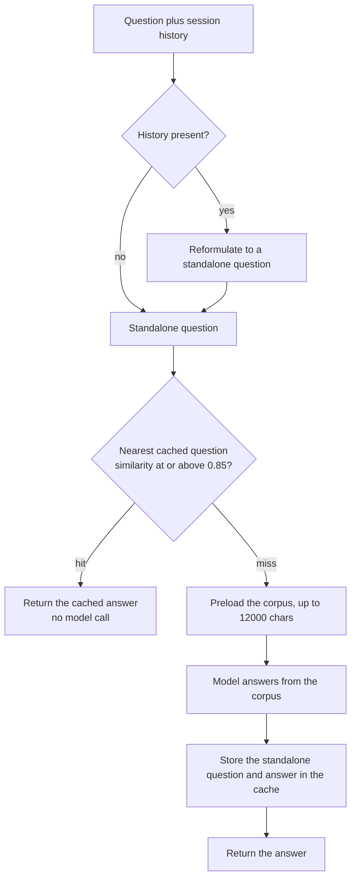
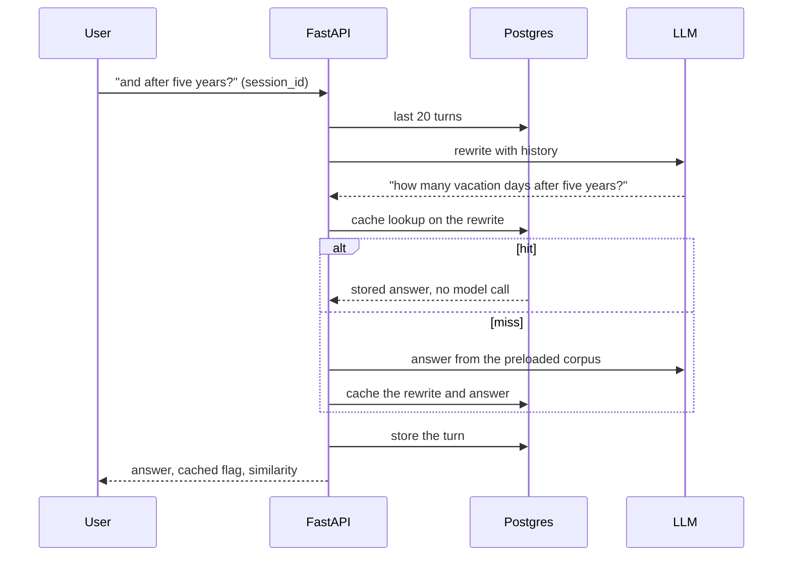

# rag-cache-2024

**Cache augmented generation: the whole corpus is preloaded into context, no retrieval at all, and repeated questions are served instantly from a semantic cache. The Cache (2024) rung of the RAG line.**

Part of the RAG line, a series of reference enterprise RAG implementations, one per retrieval strategy. This repository is the Cache (2024) rung. See [the full line](#the-rag-line) below.

[](https://github.com/mlvpatel/rag-cache-2024/actions/workflows/ci.yml)    


The clip above is a live, unedited run on a local model. The first answer comes from the preloaded corpus; the trace then shows a repeated question served from the cache with no model call. A full resolution screenshot is at [assets/screenshots/rag-cache-2024-ui.png](assets/screenshots/rag-cache-2024-ui.png). No paid keys were used.

## Contents

- [What makes it cache augmented](#what-makes-it-cache-augmented)
- [Tech stack](#tech-stack)
- [Architecture](#architecture)
- [Data model](#data-model)
- [How ingestion works](#how-ingestion-works)
- [How a question is answered](#how-a-question-is-answered)
- [Memory](#memory)
- [The mathematics](#the-mathematics)
- [How to use](#how-to-use)
- [Configuration](#configuration)
- [API reference](#api-reference)
- [A note on access](#a-note-on-access)
- [Testing](#testing)
- [Project structure](#project-structure)
- [The RAG line](#the-rag-line)

## What makes it cache augmented

Retrieval augmented generation searches for the right fragments on every question. Cache augmented generation makes a different bet: for a small, stable knowledge base, skip the search entirely.

| Idea | How it works here |
|---|---|
| Preloaded context | The full text of every document is stored and, on a miss, placed directly in the prompt (capped so it fits the context window). The model reads the whole corpus, not retrieved snippets. |
| No retrieval | There is no vector search over chunks, no hybrid fusion, and no reranker. Fewer moving parts, and nothing to tune or mis-rank. |
| Semantic cache | Every answered question is embedded and stored. A new question that is close enough, by cosine similarity, returns the cached answer with no model call, which is the fast path. |
| Cache coherence | Any corpus change, an upload or a delete, clears the whole cache, because every cached answer was generated against a corpus that no longer exists. |

The trade is deliberate: this suits small corpora that change slowly, where the whole knowledge base fits in context and questions repeat. It is the companion to retrieval, not a replacement for it.

## Tech stack

| Component | Choice | Why this one |
|---|---|---|
| API | FastAPI | Async, typed, OpenAPI for free |
| Corpus store | One Postgres table of full documents | CAG needs whole texts, not fragments; a table beats a filesystem for delete and list |
| Semantic cache | pgvector collection of past questions | The same database already holds the corpus; nearest neighbour is one query |
| Embeddings | Google gemini-embedding-001 or Ollama nomic-embed-text | Only questions are ever embedded; Ollama keeps it keyless |
| Generation | OpenAI, Anthropic, or Ollama | Routed by model name; the Ollama context window is widened to fit the corpus |
| Memory | Postgres | Windowed history, same instance |
| Ingestion | Celery + Redis | Uploads return immediately; the worker stores full text |
| UI | Streamlit | Chat surface with a hit or miss trace |
| CI | GitHub Actions | Lint, unit tests, pip-audit with no suppressions |

## Architecture

System context:



Containers:



## Data model



The cache entries deliberately have no relationship to documents: a cached answer depends on the corpus as a whole, which is exactly why any corpus change clears the entire cache rather than trying to trace which answers a document influenced.

## How ingestion works



There is no chunking and no embedding at ingest time, because nothing is retrieved. The only embedding work in the whole system happens per question.

Task lifecycle:



## How a question is answered



The cache is keyed on the standalone rewrite, never the raw follow-up. "And after five years?" means something different in every conversation; its rewrite means exactly one thing, which is what makes it safe to cache.

## Memory

Turns are stored per `session_id` in Postgres, windowed to the last 20 turns. With history present the question is rewritten to be standalone before the cache lookup, so follow-ups both resolve correctly and hit the cache when a past conversation already asked the same thing in different words.



## The mathematics

**The hit condition.** pgvector returns cosine distance $d$; the cache converts it to similarity and hits when

$$\text{sim}(q_{\text{new}}, q_{\text{cached}}) = 1 - d_{\cos} \;\geq\; \tau, \qquad \tau = 0.85$$

The threshold is the knob that trades speed for freshness of phrasing: at $\tau = 1.0$ only literal repeats hit; too low and a genuinely different question gets someone else's answer. 0.85 sits where paraphrases ("how many vacation days do I get" vs "what is the annual leave allowance") land above it and different topics land below.

**Why the cache embedding is symmetric.** Retrieval systems embed queries and documents differently because a question and its answer passage are not paraphrases. Here both sides of the comparison are questions, so one embedding function is used for both, and paraphrase similarity is exactly the signal wanted.

**The cost model.** A miss costs one question embedding plus one large generation call over the preloaded corpus. A hit costs one question embedding and nothing else:

$$\text{cost}(q) = c_{\text{embed}} + \big(1 - \mathbb{1}[\text{hit}]\big) \cdot c_{\text{LLM}}(|\text{corpus}|)$$

With a hit rate $h$, the expected generation cost falls by the factor $(1 - h)$, which is the entire economic argument for the rung: for FAQ-shaped traffic, $h$ is high, and the biggest term in the bill is multiplied by a small number.

**Greedy corpus packing.** Documents are concatenated in id order until the next block would pass the cap $C = 12000$ characters:

$$\text{used} = \max\Big\{ m : \textstyle\sum_{i=1}^{m} |b_i| \leq C \Big\}$$

then hard sliced at $C$. Documents beyond the cap are silently not in the prompt, which is the honest cost of the no-retrieval bet, and the reason the trace reports how many documents were used.

**Coherence.** Correctness demands that a cached answer is served only while the corpus it was generated from still stands. The invalidation rule is the simplest one that guarantees it: any insert or delete clears the whole cache. Selective invalidation would need to know which documents an answer depended on, which the model does not report.

## How to use

### Local, fully offline with Ollama (no paid keys)

```bash
# 1. Data services
make db-up             # postgres with pgvector, plus redis

# 2. Ollama and the local models
ollama serve &
ollama pull nomic-embed-text
ollama pull qwen2.5:7b-instruct

# 3. Install and run
make install
EMBEDDING_PROVIDER=ollama make dev        # API on :8000
make frontend                             # UI on :8501, second terminal
```

Ask a question, then ask it again, and open the trace to watch the second answer come straight from the cache.

### Try it with the bundled sample data

The repo ships sample documents in [sample_data](sample_data), an HR handbook, a product FAQ, and a real SEC 10-K excerpt. With the stack up:

```bash
make load-samples
```

This loads the full text of each document into the corpus. Then ask the questions in [sample_data/README.md](sample_data/README.md), including an honesty check where the system should decline rather than guess.

## Configuration

| Setting | Default | Meaning |
|---|---|---|
| EMBEDDING_PROVIDER | google | google or ollama |
| CAG_SIMILARITY_THRESHOLD | 0.85 | Cosine similarity at or above which a question hits the cache |
| CAG_MAX_CONTEXT_CHARS | 12000 | Cap on how much of the corpus is preloaded into the prompt |
| OLLAMA_NUM_CTX | 8192 | Context window for local models, widened to fit the corpus |
| MAX_UPLOAD_MB | 25 | Uploads rejected above this size |
| ALLOWED_ORIGINS | http://localhost:8501 | CORS allowlist |

## API reference

| Method and path | Purpose | Limit |
|---|---|---|
| GET /health | Liveness | none |
| GET /metrics | Prometheus metrics | none |
| POST /v1/chat | Cache augmented answer, with cached flag and similarity | 60/min |
| POST /v1/upload-doc | Add a document's full text to the corpus, clears the cache | 10/min, 25 MB |
| GET /v1/task/{task_id} | Poll ingestion status | none |
| GET /v1/list-docs | List documents in the corpus | none |
| POST /v1/delete-doc | Remove a document, clears the cache | none |

## A note on access

The service has no authentication, and that is a decision rather than an omission. It is a reference implementation meant to run on one machine: docker compose binds every published port, Postgres and Redis included, to `127.0.0.1`, and the containers run as a non-root user. A shipped default credential would be the worse option, since it reads as protection while sitting in a public repository. What remains is real: per route rate limiting, a hard size cap on uploads, HTML stripping on every question, and a narrow CORS origin. Put an authenticating gateway in front before exposing any of it beyond loopback.

## Testing

```bash
make test        # unit tests, no database or model needed
```

Unit tests cover the hit and miss thresholds (similarity is one minus distance), that a follow-up is rewritten before the cache lookup and cached under its rewrite, that a hit never loads the corpus or calls the model, that clearing the cache drops the collection and resets the client, greedy corpus packing at the cap, the windowed history query, and the API contract without credentials. The integration test proves an end to end cache hit against a live Ollama.

## Project structure

```
src/cag/          cache augmented core: corpus store, semantic cache, engine
src/api/          FastAPI app, endpoints, Postgres memory
src/core/         config, LLM helpers, logging
src/embeddings/   the question embedder and a plain text loader
src/worker/       Celery app and the corpus load task
frontend/         Streamlit UI with the cache trace
sample_data/      runnable sample documents
tests/            unit and integration tests
docker/           Dockerfile and Compose stack
```

## The RAG line

This repo is the Cache (2024) rung. Each rung adds one idea and keeps the ones below it.

| Year | Repository | Strategy |
|---|---|---|
| 2022 | [rag-naive-2022](https://github.com/mlvpatel/rag-naive-2022) | Naive: one dense search over Chroma |
| 2023 | [rag-advanced-2023](https://github.com/mlvpatel/rag-advanced-2023) | Advanced: hybrid, RRF and cross encoder, in Python |
| 2023 | [rag-modular-2023](https://github.com/mlvpatel/rag-modular-2023) | Modular: pgvector, RRF in SQL, streaming, memory, evaluation |
| 2024 | [rag-graph-2024](https://github.com/mlvpatel/rag-graph-2024) | Graph: entity and triple knowledge graph linked into answers |
| 2024 | rag-cache-2024, this repo | Cache: no retrieval, corpus in context with a semantic cache |
| 2025 | [rag-agentic-2025](https://github.com/mlvpatel/rag-agentic-2025) | Agentic: bounded self correcting loop, confidence gated |
| 2026 | [rag-multiagent-2026](https://github.com/mlvpatel/rag-multiagent-2026) | Multi agent: supervisor, specialists, verifier |
| 2026 | [rag-multimodal-2026](https://github.com/mlvpatel/rag-multimodal-2026) | Multimodal: text and images in one vector space |

## Author

Malav Patel. GitHub [@mlvpatel](https://github.com/mlvpatel).

## License

Released under the MIT License. See [LICENSE](LICENSE).
